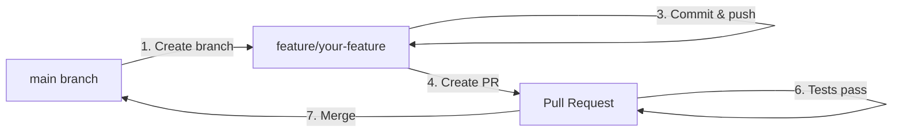

# Contributing to MECMAdminService

Thank you for your interest in contributing to the MECMAdminService PowerShell module! This guide will help you understand the project structure, testing approach, and build process.

## 📋 Table of Contents

- [Getting Started](#getting-started)
- [Branching Strategy](#branching-strategy)
- [Project Structure](#project-structure)
- [Development Workflow](#development-workflow)
- [Creating or Modifying Functions](#creating-or-modifying-functions)
- [Testing](#testing)
- [Building the Module](#building-the-module)
- [Documentation](#documentation)
- [Pull Request Process](#pull-request-process)
- [Branch Protection](#branch-protection)
- [Best Practices](#best-practices)

## � Getting Started

### For External Contributors (Recommended)

If you don't have write access to the repository:

```powershell
# 1. Fork the repository on GitHub (click "Fork" button)

# 2. Clone YOUR fork
git clone https://github.com/YOUR-USERNAME/MECMAdminService.git
cd MECMAdminService

# 3. Add upstream remote to stay in sync
git remote add upstream https://github.com/joshburkard/MECMAdminService.git

# 4. Create a feature branch (IMPORTANT!)
git checkout -b feature/your-feature-name
```

### For Core Contributors (With Write Access)

If you have write access to the repository:

```powershell
# 1. Clone the main repository
git clone https://github.com/joshburkard/MECMAdminService.git
cd MECMAdminService

# 2. ALWAYS create a feature branch (NEVER work directly on main/master!)
git checkout -b feature/your-feature-name
```

> **⚠️ IMPORTANT**: Never commit directly to `main` or `master` branch! Always use feature branches and pull requests.

## 🌳 Branching Strategy

This project follows a **feature branch workflow** with branch protection on the main branch.

### Branch Naming Conventions

Use descriptive names with prefixes:

- **feature/** - New features or functions
  - `feature/add-get-cmas-user`
  - `feature/collection-export`

- **fix/** - Bug fixes
  - `fix/connection-timeout`
  - `fix/error-handling-device-query`

- **docs/** - Documentation updates
  - `docs/update-readme`
  - `docs/add-examples`

- **refactor/** - Code refactoring (no behavior change)
  - `refactor/simplify-api-calls`
  - `refactor/improve-error-messages`

- **test/** - Adding or updating tests
  - `test/add-collection-tests`
  - `test/improve-coverage`

### Main Branch Protection

The `main` (or `master`) branch is protected with the following rules:

- ✅ **Pull requests required** - Direct pushes are blocked
- ✅ **Code review required** - At least one approval needed
- ✅ **Status checks must pass** - Structural tests must succeed
- ✅ **Branch must be up to date** - Rebase or merge before PR approval
- ✅ **Linear history** - Prefer rebase to keep history clean

### Workflow Summary



**Key principle**: All changes must go through pull requests, even for core contributors!

## �📁 Project Structure

The project follows a well-organized structure to separate source code, tests, builds, and documentation:

```
SCCMAdminService/
├── Code/                          # Source code
│   ├── function-template.ps1      # Template for new functions
│   ├── Private/                   # Internal helper functions
│   │   └── Invoke-CMASApi.ps1     # Core API interaction function
│   └── Public/                    # Exported module functions
│       ├── Connect-CMAS.ps1
│       ├── Get-CMASDevice.ps1
│       ├── Get-CMASCollection.ps1
│       └── ...                    # Other public functions
│
├── CI/                            # Continuous Integration scripts
│   ├── Build-Module.ps1           # Main build script
│   ├── Create-ModuleDocumentation.ps1  # Documentation generator
│   └── Module-Settings.json       # Module metadata
│
├── Tests/                         # Test files
│   ├── Functions.Tests.ps1        # Structural tests (BLOCKING)
│   ├── Module.Tests.ps1           # Module manifest tests
│   ├── Test-*.Tests.ps1           # Functional tests per function
│   ├── TestHelpers.ps1            # Shared test utilities
│   ├── declarations_sample.ps1    # Sample test configuration
│   └── declarations.ps1           # Your test configuration (git-ignored)
│
├── Help/                          # Generated markdown documentation
│   ├── Connect-CMAS.md
│   ├── Get-CMASDevice.md
│   └── ...                        # One file per function
│
├── MECMAdminService/              # Built module output
│   ├── 0.0.13/                    # Version folders
│   │   ├── MECMAdminService.psm1  # Compiled module
│   │   └── MECMAdminService.psd1  # Module manifest
│   └── ...                        # Previous versions
│
├── Backup/                        # Backup of previous builds
├── Examples/                      # Usage examples and scenarios
├── README.md                      # Main documentation
├── CHANGELOG.md                   # Version history
└── LICENSE                        # MIT License
```

### Key Directories

- **Code/**: Source code for all functions (both public and private)
- **CI/**: Build and documentation generation scripts
- **Tests/**: All test files using Pester framework
- **Help/**: Auto-generated markdown documentation
- **MECMAdminService/**: Built and versioned module output
- **Backup/**: Automatically created backups during builds

## 🔄 Development Workflow

> **Prerequisites**: You should have already forked/cloned the repository and created a feature branch (see [Getting Started](#getting-started)).

### 1. Ensure You're on Your Feature Branch

```powershell
# Verify you're NOT on main/master
git branch --show-current
# Should show: feature/your-feature-name

# If you're on main, create and switch to a feature branch
git checkout -b feature/your-feature-name
```

### 2. Import Development Environment

```powershell
# Import the development version for testing
Import-Module .\Code\Public\*.ps1 -Force
Import-Module .\Code\Private\*.ps1 -Force
```

### 3. Configure Test Environment (Optional)

If you want to run functional tests against an actual SCCM environment:

```powershell
# Copy the sample declarations file
Copy-Item .\Tests\declarations_sample.ps1 .\Tests\declarations.ps1

# Edit declarations.ps1 with your SCCM environment details
code .\Tests\declarations.ps1
```

> **Note**: The `declarations.ps1` file is git-ignored to prevent committing sensitive environment details.

### 4. Make Your Changes

- Create or modify functions in `Code/Public/` or `Code/Private/`
- Follow the function template in `Code/function-template.ps1`
- Use approved PowerShell verbs (Get, Set, New, Remove, etc.)
- Follow naming convention: `Verb-CMASNoun` (CMAS is the module prefix)
- Commit frequently with clear messages

### 5. Test Your Changes

```powershell
# Run structural tests (must pass before creating PR)
Invoke-Pester -Script .\Tests\Functions.Tests.ps1

# Run tests for your specific function
.\Tests\Invoke-Test.ps1 -FunctionName "Get-CMASDevice" -IncludeStructuralTests
```

### 6. Build the Module

```powershell
# Run the build process
.\CI\Build-Module.ps1
```

The build script will:
- Prompt for version number (follows Semantic Versioning)
- Prompt for description of changes
- Run structural tests (MUST PASS to continue)
- Compile all functions into a single .psm1 file
- Update the module manifest (.psd1)
- Run module validation tests
- Run functional tests (smart mode - only changed functions)
- Update CHANGELOG.md

> **Note**: Building is optional before creating a PR. The CI/CD pipeline will build and test your changes.

### 7. Commit and Push Your Changes

```powershell
# Stage your changes
git add .

# Commit with a descriptive message
git commit -m "Add Get-CMASNewFeature function"

# Push to your feature branch
git push origin feature/your-feature-name
```

### 8. Create a Pull Request

See the [Pull Request Process](#pull-request-process) section below for detailed steps.

### 9. Generate Documentation (Optional)

Documentation is generated automatically during the build, but you can also run it manually:

```powershell
# Generate markdown documentation for all functions
.\CI\Create-ModuleDocumentation.ps1
```

This creates/updates markdown files in the `Help/` folder based on your comment-based help.

### 7. Commit Your Changes

```powershell
git add .
git commit -m "Add Get-CMASNewFeature function"
git push
```

## 🆕 Creating or Modifying Functions

### Using the Function Template

Start with the provided template when creating new functions:

```powershell
# Copy the template
Copy-Item .\Code\function-template.ps1 .\Code\Public\Get-CMASNewFeature.ps1

# Edit the new file
code .\Code\Public\Get-CMASNewFeature.ps1
```

### Function Structure Requirements

Every function must include:

1. **Approved PowerShell Verb**: Use `Get-Verb` to see approved verbs
2. **Module Prefix**: All functions must use `CMAS` prefix (e.g., `Get-CMASDevice`)
3. **CmdletBinding Attribute**: `[CmdletBinding()]`
4. **Comment-Based Help** with:
   - `.SYNOPSIS` - Brief description
   - `.DESCRIPTION` - Detailed description
   - `.PARAMETER` - For each parameter
   - `.EXAMPLE` - At least one example (preferably 2-3)
   - `.NOTES` - Date, Author, Version information

5. **Parameter Validation**: Use proper parameter attributes
6. **Error Handling**: Use try/catch blocks
7. **Verbose Output**: Include `Write-Verbose` statements
8. **Consistent Return Objects**: Return `[PSCustomObject]` with consistent structure

### Example Function Structure

```powershell
function Get-CMASDevice {
    <#
    .SYNOPSIS
    Retrieve Configuration Manager device information

    .DESCRIPTION
    Queries the Configuration Manager Admin Service to retrieve device information.
    Supports querying by device name, resource ID, or retrieving all devices.

    .PARAMETER Name
    The name of the device to retrieve

    .PARAMETER ResourceID
    The ResourceID of the device to retrieve

    .EXAMPLE
    Get-CMASDevice -Name "WORKSTATION01"
    Retrieves information for the device named WORKSTATION01

    .NOTES
    Requires an active connection established with Connect-CMAS
    #>

    [CmdletBinding()]
    param(
        [Parameter(Mandatory = $false)]
        [String]$Name,

        [Parameter(Mandatory = $false)]
        [Int]$ResourceID
    )

    $function = $($MyInvocation.MyCommand.Name)
    Write-Verbose "Running $function"

    try {
        # Your implementation here
        $result = [PSCustomObject]@{
            Succeeded = $true
            Function  = $function
            Data      = $data
        }
    }
    catch {
        $result = [PSCustomObject]@{
            Succeeded  = $false
            Function   = $function
            Message    = $($_.Exception.Message)
        }
        $error.Clear()
    }

    return $result
}
```

## 🧪 Testing

The project uses **Pester 5.2.2+** for testing with multiple test levels.

### Test Types

#### 1. Structural Tests (BLOCKING)
- **File**: `Tests/Functions.Tests.ps1`
- **Purpose**: Validates function structure, naming, and documentation
- **When**: Runs first during build - **MUST PASS** to continue
- **Checks**:
  - ✅ Approved PowerShell verbs
  - ✅ Module prefix in function names
  - ✅ CmdletBinding attribute
  - ✅ Comment-based help (SYNOPSIS, DESCRIPTION, EXAMPLES)
  - ✅ Parameter documentation
  - ✅ Parameter type declarations

```powershell
# Run structural tests
Invoke-Pester -Script .\Tests\Functions.Tests.ps1
```

#### 2. Functional Tests (OPTIONAL)
- **Files**: `Tests/Test-*.Tests.ps1` (one per function)
- **Purpose**: Tests actual function behavior against SCCM environment
- **When**: Runs at end of build (if `declarations.ps1` is configured)
- **Requires**: Access to SCCM Admin Service

```powershell
# Run all functional tests
.\Tests\Invoke-Test.ps1

# Run tests for specific function
.\Tests\Invoke-Test.ps1 -FunctionName "Get-CMASDevice"

# Run with structural tests included
.\Tests\Invoke-Test.ps1 -FunctionName "Get-CMASCollection" -IncludeStructuralTests
```

#### 3. Module Tests (INFORMATIONAL)
- **File**: `Tests/Module.Tests.ps1`
- **Purpose**: Validates the built module manifest and structure
- **When**: Runs after successful build

### Creating Tests for New Functions

1. **Copy an existing test file** as a template:
   ```powershell
   Copy-Item .\Tests\Test-Get-CMASDevice.Tests.ps1 `
             .\Tests\Test-Get-CMASNewFeature.Tests.ps1
   ```

2. **Update the test file**:
   - Change function name references
   - Adjust test cases for your function's behavior
   - Add integration tests if the function interacts with SCCM
   - Add unit tests for logic and error handling

3. **Use TestHelpers**:
   ```powershell
   BeforeAll {
       . (Join-Path $PSScriptRoot "TestHelpers.ps1")
       Initialize-TestEnvironment
       Connect-TestEnvironment
   }
   ```

### Test Execution During Build

The build process uses **Smart Test Execution** by default:

- **Changed Functions Only**: Only runs tests for functions modified since last commit
- **Full Test Suite**: Set `$script:RunAllFunctionalTests = $true` in `declarations.ps1`

This prevents accidentally triggering script executions or other actions in SCCM during routine builds.

### Test Configuration

Edit `Tests/declarations.ps1` to configure your test environment:

```powershell
# SCCM Connection
$script:TestSiteServer = "sccm.yourdomain.local"
$script:TestCredential = $null  # or Get-Credential
$script:TestSkipCertificateCheck = $true

# Test Execution Control
$script:RunAllFunctionalTests = $false  # Smart mode

# Test Data
$script:TestDeviceName = "TEST-DEVICE-001"
$script:TestCollectionID = "SMS00001"
$script:TestScriptGuid = "00000000-0000-0000-0000-000000000000"
```

## 🏗️ Building the Module

### Build Process Overview

The `CI/Build-Module.ps1` script performs the following steps:

1. **Version Prompt**: Asks for semantic version number (Major.Minor.Patch)
2. **Change Description**: Asks what changed in this version
3. **Pre-Processing**: Renames any `-PRE` functions to use the module prefix
4. **Structural Tests**: Runs `Functions.Tests.ps1` (MUST PASS)
5. **Module Assembly**:
   - Combines all Private functions into a single .psm1 file
   - Combines all Public functions into the same .psm1 file
   - Creates/updates the .psd1 manifest
   - Sets version, description, author, and exports
6. **Module Tests**: Validates the manifest (informational)
7. **Functional Tests**: Runs smart or full test suite (optional)
8. **Changelog Update**: Adds version entry to CHANGELOG.md

### Running the Build

```powershell
# Navigate to the repository root
cd C:\GIT\SDWorx\SCCMAdminService

# Run the build script
.\CI\Build-Module.ps1
```

**Interactive Prompts**:
```
Enter the Version number of this module in the Semantic Versioning notation [0.0.13]
> 0.0.14

Describe what did you change
> Added Get-CMASNewFeature function for retrieving new feature data
```

### Semantic Versioning

Follow [Semantic Versioning](https://semver.org/) (Major.Minor.Patch):

- **Major** (X.0.0): Breaking changes
- **Minor** (0.X.0): New features, backward compatible
- **Patch** (0.0.X): Bug fixes, backward compatible

Examples:
- Added new function → `0.1.0` to `0.2.0`
- Fixed bug → `0.1.0` to `0.1.1`
- Breaking change → `0.1.0` to `1.0.0`

### Build Output

Successful builds create:
- `MECMAdminService/<version>/MECMAdminService.psm1` - Compiled module
- `MECMAdminService/<version>/MECMAdminService.psd1` - Module manifest
- `Backup/` - Previous versions backed up
- Updated `CHANGELOG.md` entry

### Build Failure Handling

If structural tests fail:
- Build stops immediately
- Failed tests are saved to `Tests/Failed.Tests-<timestamp>.json`
- Fix the issues and run the build again

## 📚 Documentation

### Comment-Based Help

Every function must have comprehensive comment-based help:

```powershell
<#
.SYNOPSIS
Brief one-line description

.DESCRIPTION
Detailed multi-line description explaining what the function does,
when to use it, and any important considerations.

.PARAMETER ParameterName
Description of what this parameter does and valid values

.PARAMETER AnotherParameter
Description of another parameter

.EXAMPLE
Command-Example -Parameter Value
Description of what this example does

.EXAMPLE
Command-Example -AnotherParameter Value
Another example showing different usage

.NOTES
Author: Your Name
Date: YYYY-MM-DD
Version: 1.0.0
#>
```

### Generating Markdown Documentation

Documentation is auto-generated from comment-based help:

```powershell
# Generate for all functions
.\CI\Create-ModuleDocumentation.ps1

# Output goes to Help/ folder
Get-ChildItem .\Help\*.md
```

Each function gets its own markdown file in the `Help/` folder with:
- SYNOPSIS
- DESCRIPTION
- SYNTAX
- PARAMETERS (with types and descriptions)
- EXAMPLES
- NOTES

### Updating README.md

When adding new functions, update the "Available Functions" section in README.md:

```markdown
### Category Management
- `Get-CMASCategory` - Description of function
```

## 🔀 Pull Request Process

### Creating a Pull Request

1. **Push your feature branch** to GitHub:
   ```powershell
   git push origin feature/your-feature-name
   ```

2. **Open a Pull Request** on GitHub:
   - Navigate to the repository on GitHub
   - Click "Pull requests" → "New pull request"
   - Select your feature branch as the source
   - Select `main` as the target
   - Fill in the PR template (see below)

3. **Wait for automated checks**:
   - Structural tests must pass
   - Code will be automatically reviewed
   - Any failures will be reported in the PR

4. **Request review** from maintainers

5. **Address feedback**:
   - Make requested changes in your feature branch
   - Commit and push - the PR will update automatically
   - Respond to comments and questions

6. **Merge** (done by maintainers after approval)

### Pull Request Template

Use this template when creating your PR:

```markdown
## Description
Brief description of what this PR does.

## Type of Change
- [ ] New feature (new function or capability)
- [ ] Bug fix (fixes an issue)
- [ ] Documentation update
- [ ] Code refactoring (no behavior change)
- [ ] Test improvements

## Changes Made
- Added `Get-CMASNewFeature` function
- Updated README.md with new function
- Added test file `Test-Get-CMASNewFeature.Tests.ps1`

## Testing
- [ ] Structural tests pass
- [ ] Function-specific tests created and pass
- [ ] Tested against SCCM environment (if applicable)

## Checklist
- [ ] Function follows naming convention (Verb-CMASNoun)
- [ ] Comment-based help is complete (SYNOPSIS, DESCRIPTION, EXAMPLES)
- [ ] Parameters are documented
- [ ] Error handling implemented
- [ ] Test file created (Test-FunctionName.Tests.ps1)
- [ ] Documentation generated/updated
- [ ] CHANGELOG.md updated (or will be updated during build)

## Related Issues
Closes #123 (if applicable)
```

### Code Review Process

Your PR will be reviewed for:

- ✅ **Code quality** - Follows PowerShell best practices
- ✅ **Function structure** - Proper naming, parameters, help
- ✅ **Testing** - Adequate test coverage
- ✅ **Documentation** - Clear and complete
- ✅ **Error handling** - Proper try/catch blocks
- ✅ **No breaking changes** - Unless discussed and approved

### After PR Approval

Once your PR is approved and merged:

1. **Delete your feature branch** (GitHub will prompt)
2. **Update your local repository**:
   ```powershell
   git checkout main
   git pull upstream main  # or origin main
   git branch -d feature/your-feature-name
   ```
3. **Start a new feature branch** for your next contribution

## 🔒 Branch Protection

### Repository Settings (For Maintainers)

To protect the `main` branch from direct pushes, configure these settings on GitHub:

#### Option 1: Branch Rulesets (Recommended - Modern Interface)

1. Navigate to **Settings** → **Branches** → **Add branch ruleset**
2. Configure the ruleset:

**Ruleset Name**: `Protect main branch`

**Enforcement status**: Active

**Target branches**:
- Click **Add target** → **Include by pattern**
- Enter pattern: `main` (or `master`)

**Rules** - Enable the following:
- ✅ **Require a pull request before merging**
  - Required approvals: **1** (or more)
  - Dismiss stale pull request approvals when new commits are pushed
  - Require approval of the most recent reviewable push

- ✅ **Require status checks to pass**
  - Require branches to be up to date before merging
  - Add status checks from CI/CD pipeline (if configured)

- ✅ **Require conversation resolution before merging**
- ✅ **Require signed commits** (optional, but recommended for security)
- ✅ **Require linear history** (prevents merge commits, keeps clean history)
- ✅ **Block force pushes**

**Bypass list**:
- Leave empty to apply rules to everyone (recommended), or
- Add specific users/teams who can bypass (use sparingly)

**Target**:
- ✅ Include administrators (enforces rules for everyone, including repo owners)

3. Click **Create** to save the ruleset

#### Option 2: Branch Protection Rules (Classic Interface)

If you don't see "Branch rulesets", you may be using the classic interface:

1. Navigate to **Settings** → **Branches** → **Add rule** (under "Branch protection rules")
2. Branch name pattern: `main` (or `master`)
3. Enable the following:

**Protect matching branches:**
- ✅ Require a pull request before merging
  - ✅ Require approvals: 1 (or more)
  - ✅ Dismiss stale pull request approvals when new commits are pushed
  - ✅ Require review from Code Owners (optional)

- ✅ Require status checks to pass before merging
  - ✅ Require branches to be up to date before merging
  - Add status checks: (CI/CD pipeline checks)

- ✅ Require conversation resolution before merging
- ✅ Require signed commits (optional, but recommended)
- ✅ Require linear history (prevents merge commits)
- ✅ Include administrators (enforce rules for everyone)

**Rules applied to everyone:**
- ✅ Restrict who can push to matching branches
  - Select: Allow no one (all changes via PR only)

4. Click **Create** or **Save changes**

> **Note**: GitHub is transitioning from "Branch protection rules" to "Branch rulesets". Both work, but rulesets offer more flexibility and are the recommended approach for new repositories.
# Create pre-commit hook
$hookPath = ".git\hooks\pre-commit"
$hookContent = @'
#!/bin/sh
branch="$(git rev-parse --abbrev-ref HEAD)"

if [ "$branch" = "main" ] || [ "$branch" = "master" ]; then
  echo "❌ ERROR: Direct commits to $branch are not allowed!"
  echo "Please create a feature branch:"
  echo "  git checkout -b feature/your-feature-name"
  exit 1
fi
'@

Set-Content -Path $hookPath -Value $hookContent -Encoding UTF8

# On Unix/Mac, also make executable
# chmod +x .git/hooks/pre-commit
```

This prevents you from accidentally committing to main locally.

### Why Branch Protection?

1. **Quality Control** - All code is reviewed before merging
2. **Prevents Accidents** - Can't accidentally push breaking changes
3. **Audit Trail** - Clear history of who approved what
4. **Testing** - Automated tests run before merge
5. **Documentation** - PRs serve as documentation of changes
6. **Collaboration** - Encourages discussion and knowledge sharing

## 📝 Commit Message Guidelines

Use clear, descriptive commit messages:

**Good examples:**
- `Add Get-CMASNewFeature function`
- `Fix error handling in Get-CMASDevice`
- `Update documentation for Connect-CMAS`
- `Refactor Invoke-CMASApi for better error messages`
- `Test: Add integration tests for Get-CMASCollection`
- `Docs: Update README with new examples`

**Commit message format:**
```
Type: Brief description (50 chars or less)

Optional detailed explanation of what changed and why.
Wrap at 72 characters.

Fixes #123
```

**Types:**
- `Add:` New features or functions
- `Fix:` Bug fixes
- `Update:` Updates to existing functionality
- `Refactor:` Code refactoring
- `Test:` Adding or updating tests
- `Docs:` Documentation changes
- `Build:` Build system or CI/CD changes

### Syncing Your Fork (External Contributors)

Keep your fork up to date with the main repository:

```powershell
# Fetch changes from upstream
git fetch upstream

# Switch to your main branch
git checkout main

# Merge upstream changes
git merge upstream/main

# Push to your fork
git push origin main

# Update your feature branch (if needed)
git checkout feature/your-feature-name
git rebase main
```

### Files to Ignore

The following files are typically git-ignored:
- `Tests/declarations.ps1` - Contains environment-specific test data
- `Tests/Failed.Tests*.json` - Test failure logs
- Build artifacts in `MECMAdminService/` (depending on strategy)

## 🎯 Best Practices

### Code Style

1. **Naming**: Use Pascal Case for functions, parameters, and variables
2. **Indentation**: Use 4 spaces (not tabs)
3. **Line Length**: Keep lines under 120 characters when possible
4. **Comments**: Use comments to explain "why", not "what"
5. **Verbose Output**: Add `Write-Verbose` for debugging

### Error Handling

Always include proper error handling:

```powershell
try {
    # Your code here
    $result = Invoke-Something

    return [PSCustomObject]@{
        Succeeded = $true
        Data      = $result
    }
}
catch {
    return [PSCustomObject]@{
        Succeeded = $false
        Function  = $($MyInvocation.MyCommand.Name)
        Message   = $($_.Exception.Message)
        Category  = $($_.CategoryInfo).Category
    }
    $error.Clear()
}
```

### Performance

1. **Use pipelines** where appropriate
2. **Filter early** with API queries rather than PowerShell filtering
3. **Avoid unnecessary loops** - leverage API capabilities
4. **Use `-Filter` parameter** for OData queries

### Security

1. **Never hardcode credentials** in source code
2. **Use `-Credential` parameters** for authentication
3. **Support `-SkipCertificateCheck`** for test environments only
4. **Document RBAC requirements** in function help

### Testing Best Practices

1. **Test error conditions** not just success paths
2. **Use mock data** when testing without SCCM environment
3. **Tag tests appropriately**: `Unit`, `Integration`
4. **Clean up after tests** (if they create test data)

## 🤝 Getting Help

- **Issues**: Report bugs or request features via GitHub Issues
- **Discussions**: Ask questions in GitHub Discussions
- **Documentation**: Check the `Help/` folder for function documentation
- **Examples**: Look at `Examples/` for usage scenarios

## 📄 License

By contributing, you agree that your contributions will be licensed under the MIT License.

---

**Thank you for contributing to MECMAdminService!** 🎉
